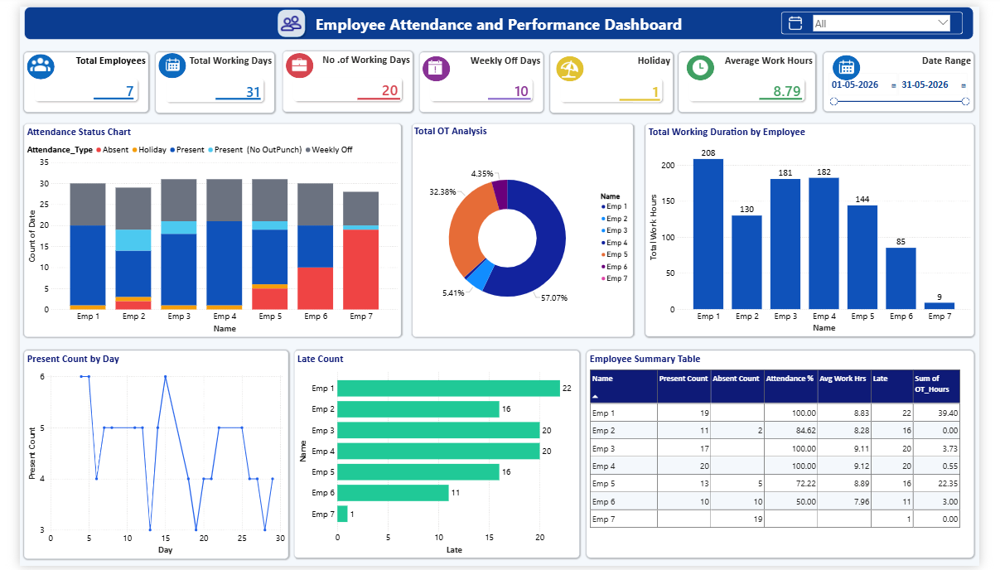

# Employee Attendance & Performance Dashboard

## 📊 Overview

The Employee Attendance & Performance Dashboard is an interactive Power BI dashboard developed to analyze employee attendance and working patterns.

The company-provided attendance data was cleaned and prepared using Python (Pandas) in Google Colab and then used in Power BI to create an interactive dashboard.

## 🎯 Project Objective

To analyze employee attendance, working hours, overtime, and late attendance and present the information through an easy-to-understand interactive dashboard.

## 🖥️ Dashboard Preview

## 🔑 Key Features

* Employee attendance analysis
* Working days and weekly off analysis
* Working hours analysis
* Overtime analysis
* Daily present count analysis
* Late count analysis
* Employee-wise attendance summary
* Interactive slicers

## 📌 Key Performance Indicators

* Total Employees
* Total Working Days
* No. of Working Days
* Weekly Off Days
* Holidays
* Average Work Hours

## 📈 Dashboard Visualizations

* Attendance Status Chart
* Total OT Analysis
* Total Working Duration by Employee
* Present Count by Day
* Late Count
* Employee Summary Table

## 📂 Dataset

The dataset contains employee attendance records used for analysis. Employee names were anonymized as Emp 1, Emp 2, Emp 3, etc.

## 🔄 Project Workflow

**Excel → Python (Pandas) → Data Cleaning → Power BI → Interactive Dashboard**

## 🛠️ Tools & Technologies

* Microsoft Excel
* Python
* Pandas
* Google Colab
* Power BI

## 🧠 Skills Demonstrated

* Data Cleaning
* Data Preprocessing
* Data Analysis
* Data Visualization
* KPI Creation
* Power BI Dashboard Development
* Python Pandas
* Excel Data Handling

## 📁 Project Contents

* `Dataset/Attendance_Cleaned_Dataset.xlsx` – Cleaned attendance dataset
* `Dashboard_Screenshot.png` – Power BI dashboard preview
* `README.md` – Project documentation
